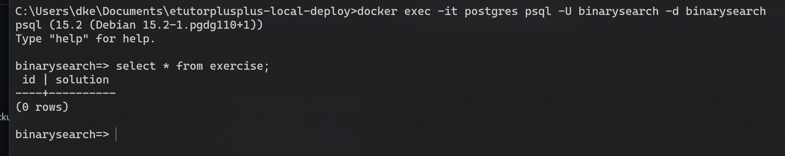

# Tutorial: Implementing an expert module
This tutorial will showcase how one **could** implement an expert module into the dke-dispatcher.
A simple number guessing game will be used as an example, the module for which is called *binary search*.

Each subsection will conclude with a link to the commit that contains the changes made to the source-code of this subsection.

A dedicated branch feature/binarysearch also exists as a reference.

## 0. Module Introduction - *binarysearch*
The *binarysearch* module is quite simple: it should be possible to create, modify and delete a task defined by a number which student's
have to guess.

When a student's submissions is received, the module will compare the input to the solution
and return whether the searched number is *smaller than, equal or greater* than the input.

By implementing this module we want to show which actions have to be taken to integrate any module.

## 1. Setting up the database
We will use the postgresql docker container contained in the [local-deploy](https://github.com/eTutor-plus-plus/local-deploy/tree/feature/binarysearch).
The image of this container is a plain postgresql image and an [initialization-script](https://github.com/eTutor-plus-plus/local-deploy/blob/feature/binarysearch/volumes/postgres/init/dump.sql) is mounted inside the container
upon the first start of the container.

### 1.1 Creating a dedicated database user
We will create a dedicated database user with no permissions other than *login* for the module, called *binarysearch*.
For this we add the necessary *CREATE ROLE* statement to the initialization script.
The default password equals the username.

Furthermore, we set the password in the [env-file](https://github.com/eTutor-plus-plus/local-deploy/blob/feature/binarysearch/.env) so we can pass it to 
the container of the *dke-dispatcher* inside the [docker-compose file](https://github.com/eTutor-plus-plus/local-deploy/blob/feature/binarysearch/docker-compose.yaml).

The environment variable should define the value of the property used as a password for connecting to the database
from the *dke-dispatcher*.
Therefore, we create the necessary properties for the database connection in the property file**s** ([1](https://github.com/eTutor-plus-plus/dke-dispatcher/blob/feature/binarysearch/src/main/resources/application.properties), [2](https://github.com/eTutor-plus-plus/dke-dispatcher/blob/feature/binarysearch/resources/docker/application.properties)).
For the local setup, we set both user and password as constants.
For the docker container and the production environment, we refer to the environment variable for the password.

We also have to make changes to the [*ApplicationProperties* class](https://github.com/eTutor-plus-plus/dke-dispatcher/blob/feature/binarysearch/src/main/java/at/jku/dke/etutor/grading/config/ApplicationProperties.java) so we can
load the configuration from the properties file.

**The commits reflecting this subsection can be found [here](https://github.com/eTutor-plus-plus/local-deploy/commit/3a7dbb76df0aeaf359560bd0b470e700c0959726), for the *local-deploy*,
and [here](https://github.com/eTutor-plus-plus/dke-dispatcher/commit/b411d7332933fe44c620a0af1ce99e45b5508432) for the *dke-dispatcher***

### 1.2 Creating the database schema
Next we will create a database for the module and the required tables.
For this we modify the [initialization-script](https://github.com/eTutor-plus-plus/local-deploy/blob/feature/binarysearch/volumes/postgres/init/dump.sql) of the *local-deploy*.

We set the user created in the previous section as owner of the database.
Due to the simplicity of the module, we require only one table where each row represents
one exercise configuration defined by the number that has to be searched.

For the internal exercise id of the dispatcher, we also create a database sequence generator.

The commit reflecting the changes of this subsection can be found [here](https://github.com/eTutor-plus-plus/local-deploy/commit/203dddb251bb1e1e05e4a0f3de0636551914ded7).

At this point we should be able to start the postgresql container with the following command
(from the root-directory of the *local-deploy*):
```
docker-compose up -d postgres
```
*Note*: If you previously started the postgres container, you have to delete the [data-directory](), otherwise
the container will not execute the script again.

If we look at the logs of the container upon startup, we can see that the script is executed
and the necessary tables etc. are created. 
This may take a while.


Now we are also able to connect to the created database
with the binarysearch user:
```
docker exec -it postgres psql -U binarysearch -d binarysearch
```


### 1.3 Creating a connection pool
To manage the connections to the database from within our application
we create a configuration-class containing a Hikari-connection-pool
and a static method to get a connection from the pool.

First, we have to add the URL of our database to the property files,
and add the field to the *ApplicationProperties* class.

We can now inject this class into our configuration class and configure
the connection pool.

Lastly, we have to register our class for component-scanning in
[here](https://github.com/eTutor-plus-plus/dke-dispatcher/blob/feature/binarysearch/src/main/java/at/jku/dke/etutor/grading/ETutorGradingApplication.java).

We should now be able, given the database container is running,
to start the application.

**The commits reflecting this subsection can be found [here]().**

## 2. Managing exercises programmatically


